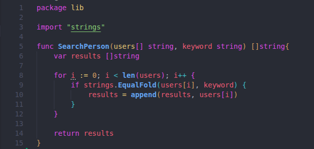
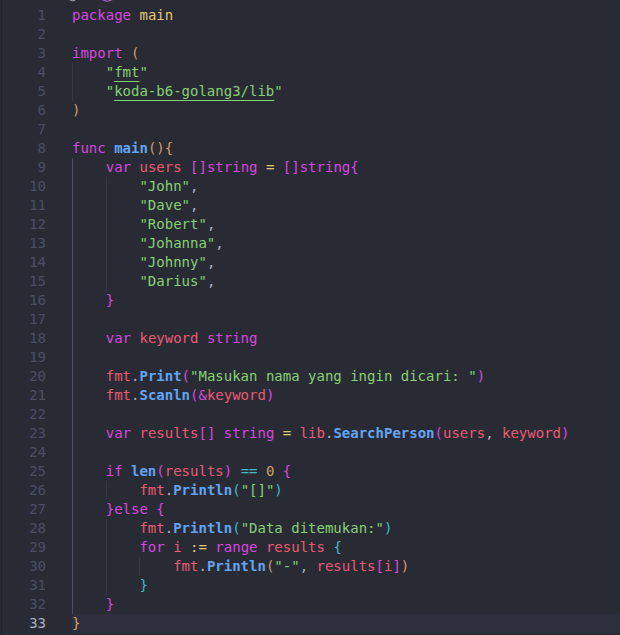
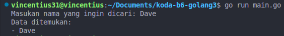

# Person Search CLI App

Program pencarian nama sederhana menggunakan bahasa pemrograman Go. Program ini mendemonstrasikan penggunaan *custom package*, manipulasi *slice*, dan perbandingan string.

---





## Analisis Kode

### 1. Daftar Package
* **`fmt`**: Digunakan untuk operasi I/O (Input/Output), seperti mencetak teks ke terminal dan menerima input dari keyboard.
* **`strings`**: Digunakan untuk pemrosesan string. Di program ini, kita memakai `strings.EqualFold`.
* **`lib`**: Package internal yang berfungsi sebagai pustaka logika bisnis (pencarian data).

### 2. Penjelasan Fungsi
#### `lib.SearchPerson(users []string, keyword string) []string`
* **Kegunaan**: Mencari string yang cocok di dalam sebuah kumpulan data (*slice*).
* **Cara Kerja**:
    1. Membuat variabel `results` untuk menampung hasil yang ditemukan.
    2. Melakukan perulangan (`for loop`) untuk memeriksa setiap elemen dalam `users`.
    3. Menggunakan **`strings.EqualFold`** yang membandingkan teks secara *case-insensitive* (tidak membedakan huruf besar dan kecil). Contoh: "John" sama dengan "john".
    4. Jika cocok, elemen tersebut ditambahkan ke `results`.


---

## Alur Program (`main.go`)
1. **Definisi Data**: Program memiliki daftar nama tetap: *John, Dave, Robert, Johanna, Johnny, Darius*.
2. **Input**: Mengambil kata kunci dari pengguna menggunakan `fmt.Scanln`.
3. **Pemrosesan**: Memanggil fungsi dari package `lib`.
4. **Validasi**: 
    - Jika hasil kosong, tampilkan `[]`.
    - Jika ada, tampilkan daftar nama menggunakan perulangan.




---

## Cara Menjalankan
1. Pastikan struktur folder sudah benar (file `search.go` berada di dalam folder `lib`).
2. Jalankan perintah berikut di terminal:
   ```bash
   go run main.go